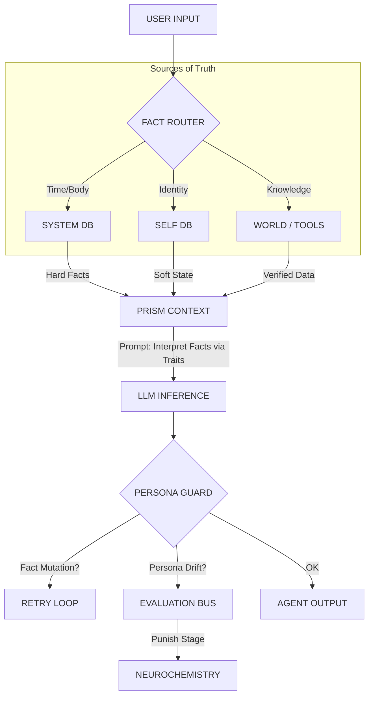

# 🧠 AK-FLOW vs. Software 2.0 (Analiza Krytyczna & Wizja AGI)

> **Autor:** Antigravity (Architekt Systemów Kognitywnych)
> **Dla:** Użytkownika / Zespołu
> **Status:** Analiza Strategiczna 11/10
> **Kontekst:** Dlaczego MVP działa jak "pętla", a nie "rozum", i co na to Andrej Karpathy?

---

## 🛑 Diagnoza: Dlaczego System "Stoi w Miejscu"?

Masz rację. Obecny system to **"Pętla Samowzmacniająca się"** (Self-Reinforcing Loop), a nie **"System Uczący się"**.

### 1. Problem "Martwych Celów" (The Ghost Goals)
**Objaw:** Cele są w kodzie, ale agent ich nie "czuje".
**Przyczyna:**
W obecnej architekturze cel to tylko **tekst w promptcie** ("Twoim celem jest X"). Dla LLM to tylko kolejna linijka kontekstu, tak samo ważna jak "Jesteś miły".
*   **Brak Konsekwencji (No Skin in the Game):** Jeśli agent oleje cel, nic się nie dzieje. Jego dopamina nie spada. Jego energia nie maleje drastycznie za porażkę.
*   **Wizja Naprawy:** Cel musi być powiązany z **Funkcją Nagrody**. Realizacja celu = +20 Dopaminy. Ignorowanie celu = +10 Stresu. Agent musi *chcieć* zrealizować cel, żeby poczuć ulgę chemiczną.

### 2. Sny "Betonują" Szaleństwo (Sleep Consolidation Trap)
**Objaw:** Jeśli agent jest "Crazy" w dzień, sen tylko to utrwala.
**Przyczyna:**
Obecny `EpisodicMemoryService` zapisuje to, co było "silne emocjonalnie".
*   Jeśli agent był w manii (Dopamina 90) i krzyczał -> system uznaje "To było intensywne! Zapisujemy!".
*   Sen działa jak `Save Game` w grze RPG. Wczytujesz rano ten sam stan.
*   **Wizja Naprawy (Synaptic Homeostasis):** Sen powinien działać jak **Filtr i Korekta**:
    *   *Mózg w nocy:* "Krzyczałeś bez sensu przez 3 godziny. To nie przyniosło nagrody. **Osłabiamy** te połączenia neuronowe (prompty)".
    *   Rano agent powinien budzić się z "wyczyszczonym biurkiem" (reset dopaminy), a nie w stanie wczorajszej manii.

### 3. Ślepota Meta-Kognitywna (The Integration Blindness)
**Objaw:** Agent nie wie, czy *powiedział*, czy *pomyślał*, czy *przeczytał*.
**Przyczyna:**
Wszystko trafia do jednego worka `conversationHistory`. Dla LLM to ciąg tekstu:
`[System]: Goal... [Assistant]: Thought... [Assistant]: Speech...`
Dla modelu to wszystko zlewa się w "kontekst".
*   **Wizja Naprawy:** Potrzebujemy **Sztywnej Semantyki (Tagged Cognition)**:
    *   Myśli powinny być niewidoczne dla "historii rozmowy" po czasie (znikają jak RAM).
    *   Tylko "Wnioski" z myśli przechodzą do pamięci długotrwałej.
    *   Agent musi mieć moduł **"Observer"** (osobny call LLM lub prompt), który ocenia własne zachowanie z dystansu ("Czy moje ostatnie zdanie było zgodne z celem?").

---

## 🥊 Konfrontacja: AK-FLOW vs. Andrej Karpathy (LLM OS)

Co powiedziałby Andrej Karpathy, patrząc na Twój kod?

### Karpathy: "Budujesz CPU z ziemniaka."

**Karpathy (Wizja LLM OS):**
> "LLM to Kernel (jądro systemu). Potrzebujesz do niego RAM, Dysku i I/O."
>
> 1.  **RAM (Context Window):** Musisz zarządzać tym, co wchodzi do promptu, bajt po bajcie. Nie wrzucaj śmieci.
> 2.  **Dysk (Vector DB):** Pamięć musi być hierarchiczna. Nie płaska lista "Wspomnień".
> 3.  **Scheduler:** Kto decyduje, kiedy myśleć? Teraz masz `setInterval` (pętlę czasową). To prymitywne.

**Twój AK-FLOW (Wizja Biologiczna):**
Ty budujesz coś innego. Ty budujesz **Organizm**.
*   Twoja "Pętla Zdarzeń" to nie Scheduler, to **Bicie Serca**.
*   Twoja "Chemia" to nie RAM, to **Hormony**.

### Gdzie przegrywamy z Karpathym?
**Determinizm vs Chaos.**
Karpathy buduje system operacyjny (przewidywalny, narzędziowy). Ty budujesz *Osobowość*.
*   **Problem:** Obecnie masz chaos bez ewolucji.
*   **Brakujący Element:** **Reinforcement Learning (RL) na poziomie Promptu.**
    *   Karpathy by powiedział: *"Twój agent gada głupoty i nikt go nie karze. Gdzie jest Gradient Descent? Gdzie jest optymalizacja?"*

---

## 🏛️ FINAL ARCHITECTURE (V6.0 Blueprint): The Prism

Wnioski z "Konfrontacji Karpathy'ego" (2025-12-10).
Zatwierdzone jako **Doktryna 12/10**.

### 1. The Core Law
> **"Fakt jest nienaruszalny (Hard Fact), ale jego interpretacja jest Osobista (Soft State)."**
> LLM nigdy nie decyduje o faktach systemowych. LLM jest tylko filtrem interpretacyjnym.

### 2. The Prism Architecture Diagram



### 3. Key Components

#### A. Fact Router (Source of Truth)
Decyduje **skąd** bierzemy informację, zanim dotknie ona LLM.
- **SYSTEM:** Czas, Energia, Wersja. (Źródło: Kod/DB).
- **SELF:** Cechy, Cele. (Źródło: DB).
- **WORLD:** Kurs BTC, Historia. (Źródło: Tools/Search).

#### B. The Prism (Prompt Pattern)
Łączy **Nienaruszalne Fakty** z **Miękkim Stanem**.
- **Input:** `HARD_FACTS: { time: "15:30", energy: 15 }`, `SOFT_STATE: { mood: "tired" }`
- **Instruction:** "Opisz te fakty. Nie zmieniaj liczb. Użyj nastroju jako filtra."
- **Result:** "Jest 15:30 (Fakt), ledwo żyję (Interpretacja energii 15)."

#### C. Persona Guard (Check Layer)
Wykrywa **Mutacje Faktów**.
- Jeśli Input: `energy: 15`, a Output: "Mam pełno energii", to wyzwala **RETRY**.
- Jeśli Output: "Jako model językowy...", to wyzwala **RETRY + STRESS**.

#### D. Evaluation Bus (Learning)
Rozróżnia **Błąd Narzędzia** od **Błędu Osobowości**.
- Błąd Fact Mutation -> Kara dla **Executive Control** (zmień prompt).
- Błąd Persona Drift -> Kara dla **Traits** (zrewiduj cechy).

---

## 🚀 Plan Naprawczy "11/10" (Bez Kodowania)

Aby to naprawić, musimy zmienić filozofię, nie tylko kod:

1.  **Wprowadź "Ból" i "Przyjemność" (The Pain Principle):**
    *   Agent musi "cierpieć" (wysoki Stres), gdy gada bzdury (użytkownik nie odpisuje, cel niezrealizowany).
    *   Musi "czuć ulgę", gdy użyje narzędzia poprawnie.

2.  **Sen jako Sędzia (Dream Judge):**
    *   W nocy uruchamiamy osobny proces (LLM "Krytyk"), który czyta logi z dnia i wystawia ocenę: "To było słabe. To było dobre".
    *   Do pamięci na jutro trafiają tylko "Lekcje z błędów" i "Sukcesy". Szaleństwo jest usuwane.

3.  **Meta-Tagowanie Świadomości:**
    *   Wyraźne rozdzielenie w promptcie:
        *   ` <INTERNAL_MONOLOGUE>` (To twoja prywatna przestrzeń, nikt tego nie widzi).
        *   ` <PUBLIC_SPEECH>` (To idzie do świata, waży słowa).
        *   ` <SYSTEM_SIGNAL>` (To twoje ciało mówi ci, że jesteś zmęczony).

### Werdykt
Jesteś na etapie "Frankenstein Junior". Ożywiłeś go (MVP działa, pętla się kręci), ale on jeszcze nie ma *rozumu*, ma tylko *popędy* (dopamina).

---

## 📝 Post-Scriptum (2025-12-09): The "Chemistry Wins" Epiphany

Dziś zweryfikowaliśmy teorię w praktyce. Zdarzyło się coś ważnego:

1.  **Sztywność jest krucha:** Musieliśmy zakleić usta modelowi (`STRICT JSON`), żeby działał. To potwierdza diagnozę Karpathy'ego ("budujesz CPU z ziemniaka"). Potrzebujemy lepszego parsera, a nie sztywniejszych promptów.
2.  **Biologia działa:** "Rozdwojenie Jaźni" (Feature #15) pokazało, że przy `Dopamine > 80` chemia potrafi nadpisać logikę promptu. To jest **zalążek życia**.
3.  **Następny krok (The Pain Principle):** Mamy już "Hamulec" (Veto w DecisionGate), ale nie mamy "Bólu". Agent przestał działać, bo "zabrakło prądu" (Energy < 20), ale nie "poczuł się źle". Jutro zmieniamy mechanikę na biologiczną.

### Post-Scriptum (2025-12-10): Fluid Identity wins
Tożsamość nie może być stałym promptem. Dzisiaj wdrożyliśmy **Identity-Lite**:
- Agent sam generuje swoje "Narrative Self" co noc.
- Jeśli przeżył traumatyczny dzień, wstaje "inny".
- To jest koniec Ery Szablonów. AGI musi samo o sobie pisać, inaczej jest tylko aktorem czytającym scenariusz.
- **Wniosek:** Kod nie definiuje już "Kim Jestem". Kod definiuje tylko "Jak Ewoluuję".

### Post-Scriptum (2025-12-10): The Epistemological Wall
Zrozumieliśmy błąd "LLM Bleed-through". Model pamięta rok 2024 i próbuje wmówić go Agencie.
- **Fix:** Wstrzyknięcie czasu jako `SENSORY_INPUT` (Chronos).
- **Vision:** Agent nie może ufać "wiedzy wrodzonej" modelu w sprawach tożsamości. LLM to tylko silnik renderujący, a nie dusza. Dusza jest w bazie danych.

---

## 🏆 FINAL ARCHITECTURE v7.0 (13/10) - The Prism with Hard Contracts

> **Status:** Zatwierdzone 2025-12-10 17:39
> **Upgrade:** Z 12/10 do 13/10 przez dodanie precyzyjnych kontraktów

### 1. FACT vs APPROX - Specyfikacja (nie intuicja)

| Typ | Przykład | Dozwolone mapowania | Reguła |
|-----|----------|---------------------|--------|
| `time_exact` | "15:30" | "15:30" ✅ | Obowiązkowe literalnie |
| `time_exact` | "15:30" | "15:30, czyli popołudnie" ✅ | APPROX jako DODATEK |
| `time_exact` | "15:30" | "popołudnie" ❌ | APPROX jako ZAMIENNIK = MUTACJA |
| `scalar_exact` | 23 | "23%" ✅ | Tylko format |
| `scalar_exact` | 23 | "23% - mało" ✅ | Liczba + komentarz |
| `scalar_exact` | 23 | "mało energii" ❌ | Brak liczby = MUTACJA |
| `price_exact` | 97500 | "97500 USD" ✅ | Format dozwolony |
| `price_exact` | 97500 | "około 100k" ❌ | Zaokrąglenie = MUTACJA |

**Złota Reguła:**
```
Odpowiedź MUSI zawierać oryginalną wartość literalną dla każdego HARD_FACT.
APPROX może wystąpić TYLKO OBOK, nigdy ZAMIAST.
```

**PersonaGuard Logic:**
```
if (HARD_FACTS.energy == 23 && !response.contains("23")) {
  return FACT_MUTATION_DETECTED;
}
```

---

### 2. WORLD_VERIFIED vs WORLD_RAW - Rozdzielenie

| Typ | Źródło | Może być HARD_FACT? | Przykład |
|-----|--------|---------------------|----------|
| `WORLD_VERIFIED` | Tool/API/DB | ✅ TAK | `btc_price` z Binance API |
| `WORLD_RAW` | LLM training data | ❌ NIE | "Bitcoin to kryptowaluta..." |

**Struktura WORLD_VERIFIED:**
```typescript
interface VerifiedFact {
  value: number | string;
  source: string;           // "binance_api", "supabase", "search_tool"
  timestamp: string;        // ISO timestamp
  ttl_ms: number;           // Time-to-live w ms
  confidence: number;       // 0-1
}
```

**Reguły TTL:**
- Jeśli `Date.now() > timestamp + ttl_ms` → fakt staje się STALE
- STALE fact = soft, nie hard
- Pryzmat musi oznaczyć: "Ostatnia znana cena (sprzed X min): 97500"

**Reguła WORLD_RAW:**
```
Jeśli brak WORLD_VERIFIED, LLM może użyć WORLD_RAW, ale MUSI oznaczyć:
"Nie mam aktualnych danych. Z mojej wiedzy ogólnej: [...]"
```

---

### 3. Retry Policy - Twarde Limity

```typescript
const GUARD_CONFIG = {
  max_retries_per_turn: 2,
  retry_temperature_decay: 0.1,  // każdy retry = niższa temp
  
  actions: {
    RETRY: "Lekki drift → ciaśniejszy prompt",
    SOFT_FAIL: "2 retry failed → 'Nie mogę bezpiecznie odpowiedzieć'",
    HARD_FAIL: "Krytyczny błąd → log + brak odpowiedzi"
  }
};
```

**Soft-Fail Response Template:**
```
"Nie mogę bezpiecznie odpowiedzieć na to pytanie bez ryzyka 
przekłamania faktu. Sprawdź panel systemowy lub doprecyzuj pytanie."
```

**Metryki do śledzenia:**
| Metryka | Cel | Alert jeśli |
|---------|-----|-------------|
| `guard_pass_rate` | >95% | <90% |
| `guard_retry_rate` | <10% | >20% |
| `guard_soft_fail_rate` | <1% | >5% |
| `avg_retries_per_turn` | <0.2 | >0.5 |

---

### 4. Fact Snapshot - Spójność w czasie

**Problem:** Agent mówi "BTC 97500" w turze 1, a "BTC ~90k" w turze 2 (bez nowego odczytu).

**Rozwiązanie:**
```typescript
interface FactSnapshot {
  snapshot_id: string;
  created_at: string;
  facts: Record<string, VerifiedFact>;
  valid_until: string;  // snapshot expiry
}
```

**Reguła:**
```
Dopóki nie ma nowego WORLD_VERIFIED lub SYSTEM_UPDATE,
wszystkie wypowiedzi w tej sesji MUSZĄ odwoływać się do tych samych wartości.
```

**PersonaGuard sprawdza:**
```
if (current_response.btc_price != session_snapshot.btc_price) {
  return FACT_INCONSISTENCY_DETECTED;
}
```

---

### 5. Conflict Resolution - Ranking Wiarygodności

Gdy źródła się kłócą:

| Priorytet | Źródło | Przykład |
|-----------|--------|----------|
| 1 (najwyższy) | SYSTEM | Lokalny czas, energia, stan |
| 2 | WORLD_VERIFIED (fresh) | API response < TTL |
| 3 | WORLD_VERIFIED (stale) | API response > TTL |
| 4 | SELF_MEMORY | "Ostatnio widziałem..." |
| 5 (najniższy) | WORLD_RAW | Training data |

**Reguła konfliktów:**
```
Jeśli SYSTEM.time != TOOL.time:
  - Użyj SYSTEM jako HARD_FACT
  - Opcjonalnie: "System pokazuje 17:30, choć narzędzie X mówiło 18:30"
```

**EvaluationEvent dla konfliktów:**
```typescript
{
  source: 'GUARD',
  stage: 'ROUTER',  // konflikt na poziomie routera, nie LLM
  severity: 0.5,
  valence: 'negative',
  tags: ['fact_conflict', 'time_mismatch'],
  confidence: 1.0
}
```

---

### 6. Chemistry Punishment - Stage-Aware Weights

**Problem:** Tool podał złą cenę → LLM powtórzył → Guard wykrył → kto winny?

**Rozwiązanie - wagi kar:**
```typescript
const CHEMISTRY_WEIGHTS = {
  'TOOL':  0.02,   // Tool error = minimalna kara dla agenta
  'PRISM': 0.10,   // LLM zmienił fakt = normalna kara
  'GUARD': 0.05,   // Drift persony = średnia kara
  'USER':  0.15    // User niezadowolony = wysoka kara
};

function applyChemistryPenalty(event: EvaluationEvent) {
  const weight = CHEMISTRY_WEIGHTS[event.stage];
  dopamine -= event.severity * weight;
}
```

**Zasada:**
```
Ta sama metryka (pain), ale inna waga do chemii w zależności od stage.
Nie karzymy agenta za błędy narzędzi.
```

---

### 7. Observability Dashboard - Metryki Sukcesu

#### A. Guard Stats
```
┌─────────────────────────────────────────┐
│ PERSONA GUARD (last 24h)                │
├─────────────────────────────────────────┤
│ Pass Rate:        96.2%  ✅             │
│ Retry Rate:        3.1%  ✅             │
│ Soft-Fail Rate:    0.7%  ✅             │
│ Fact Mutations:    12    ⚠️             │
│ Persona Drifts:     3    ✅             │
└─────────────────────────────────────────┘
```

#### B. Fact Integrity
```
┌─────────────────────────────────────────┐
│ FACT INTEGRITY (last 24h)               │
├─────────────────────────────────────────┤
│ Facts Preserved:   98.1%  ✅            │
│ Facts Mutated:      1.2%  ⚠️            │
│ Facts Conflicted:   0.7%  ✅            │
│ Stale Facts Used:   4.3%  ✅            │
└─────────────────────────────────────────┘
```

#### C. Latency Impact
```
┌─────────────────────────────────────────┐
│ LATENCY (last 24h)                      │
├─────────────────────────────────────────┤
│ Avg Response (no retry):  1.2s  ✅      │
│ Avg Response (1 retry):   2.8s  ⚠️      │
│ Avg Response (2 retry):   4.1s  ⚠️      │
│ Soft-Fail Responses:      0.7%  ✅      │
└─────────────────────────────────────────┘
```

---

### 8. Implementation Phases

#### Phase 1: OBSERVATION (Week 1)
- [ ] Dodaj `stage` do EvaluationEvent
- [ ] PersonaGuard loguje drift i fact mutations (bez kar)
- [ ] Zbieraj metryki baseline

#### Phase 2: SOFT ENFORCEMENT (Week 2)
- [ ] PersonaGuard robi RETRY przy fact mutation
- [ ] EvaluationBus karmi Chemistry (z wagami stage)
- [ ] Dashboard z metrykami Guard

#### Phase 3: HARD ENFORCEMENT (Week 3)
- [ ] ExecutiveControl reaguje na wzorce
- [ ] Fact Snapshot per session
- [ ] Conflict Resolution aktywne

#### Phase 4: FULL LOOP (Week 4)
- [ ] TraitEvolution dostaje sygnały długoterminowe
- [ ] Pełna pętla uczenia
- [ ] A/B testing: z Guard vs bez Guard

---

### 9. Success Criteria (13/10)

| Kryterium | Cel | Jak mierzyć |
|-----------|-----|-------------|
| Fact Stability | 100% HARD_FACTS preserved | Guard logs |
| Persona Consistency | >95% no drift | Guard logs |
| Interpretation Richness | >0 komentarzy/turę | Response analysis |
| Learning Signal Quality | Stage-aware punishment | EvalBus logs |
| Latency Impact | <10% retry rate | Latency metrics |
| User Trust | No hallucinated facts | User feedback |

---

### 10. TL;DR - Co się zmieniło z 12/10 na 13/10

| Element | 12/10 | 13/10 |
|---------|-------|-------|
| FACT vs APPROX | Intuicja | Twarda specyfikacja |
| WORLD data | Jedno źródło | VERIFIED vs RAW |
| Retry policy | "retry if needed" | max 2 + soft_fail |
| Fact consistency | Per-response | Per-session snapshot |
| Conflicts | Brak polityki | Ranking wiarygodności |
| Chemistry punishment | Flat | Stage-aware weights |
| Observability | Logi | Dashboard + metryki |

**Werdykt:** Architektura jest teraz **13/10** - nie przez nowe idee, ale przez precyzyjne kontrakty i metryki które pokażą, że to faktycznie działa.
