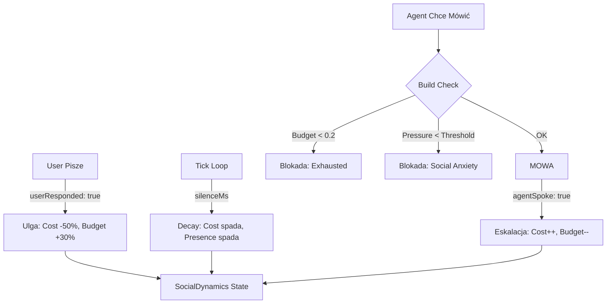

# Social Dynamics - Soft Homeostasis (FAZA 6)

## 🌟 Wprowadzenie

**SocialDynamics** to mechanizm **miękkiej homeostazy** regulujący autonomiczną mowę agenta. Zamiast sztywnych limitów ("max 3 wypowiedzi na minutę"), używa dynamicznych kosztów i budżetów inspirowanych biologią (dopaminą i energią społeczną).

Rozwiązuje problem **"Spamującego Agenta"**, który w trybie autonomicznym mówił bez przerwy, niezależnie od tego, czy użytkownik odpowiadał. Teraz agent "męczy się" mówieniem bez odpowiedzi i "regeneruje" po interakcji.

---

## 🏗️ Architektura

### Model Danych (`SocialDynamics`)

```typescript
interface SocialDynamics {
  socialCost: number;                 // 0-1, koszt mówienia (rośnie z każdą wypowiedzią)
  autonomyBudget: number;             // 0-1, "energia" na autonomiczną mowę
  userPresenceScore: number;          // 0-1, czy user jest obecny (decay w ciszy)
  consecutiveWithoutResponse: number; // ile razy agent mówił bez odpowiedzi usera
}
```

### Pętla Sprzężenia Zwrotnego

1. **Eskalacja Kosztów (Agent Mówi):**
   Każda autonomiczna wypowiedź zwiększa `socialCost`. Jeśli użytkownik milczy, koszt rośnie wykładniczo (kara za monologowanie).

2. **Ulga i Regeneracja (User Odpowiada):**
   Gdy użytkownik odpisuje, `socialCost` spada o 50% (ulga), a `autonomyBudget` otrzymuje doładowanie. To sygnał: "Jesteś słuchany, możesz mówić dalej".

3. **Time Decay (Czas Płynie):**
   W każdej sekundzie ciszy:
   - `socialCost` powoli spada (zapominanie zmęczenia).
   - `userPresenceScore` maleje (zapominanie o obecności człowieka).

---

## 🧠 Logika Decyzyjna

Zanim agent powie cokolwiek autonomicznie, `EventLoop` sprawdza:

```typescript
effectivePressure = voicePressure - socialCost
dynamicThreshold = 0.6 + (1 - userPresenceScore) * 0.3

// Warunek 1: Czy mam budżet?
if (autonomyBudget < 0.2) → BLOKADA (Wyczerpanie)

// Warunek 2: Czy pressure przebija barierę społeczną?
if (effectivePressure < dynamicThreshold) → BLOKADA (Zbyt duży koszt społeczny)
```

Gdy użytkownik milczy długo (`userPresenceScore` bliski 0), próg (`dynamicThreshold`) rośnie do 0.9, co oznacza, że agent odezwie się tylko w przypadku **ekstremalnie ważnej** myśli (wysoki `voicePressure`).

---

## 🛠️ Implementacja

| Komponent | Rola | Plik |
|-----------|------|------|
| **Stan** | Definicja interfejsu i stanu początkowego | `core/kernel/types.ts`, `initialState.ts` |
| **Logika Zmian** | Reducer obsługujący eventy `SOCIAL_DYNAMICS_UPDATE` | `core/kernel/reducer.ts` |
| **Decyzja** | Funkcja `shouldSpeakToUser` sprawdzająca progi | `core/systems/EventLoop.ts` |
| **Trigger** | Hooki wywołujące update przy akcji usera/agenta | `hooks/useCognitiveKernelLite.ts` |

---

## 🎨 Integracja ze StyleGuard

Jako warstwa ostateczna, **StyleGuard** może (opcjonalnie) formatować wypowiedź zgodnie z "kontraktem stylowym" (osobowością agenta).

```typescript
// Social Dynamics pozwoliło na mowę, ale StyleGuard decyduje JAK to powiedzieć
const styleResult = StyleGuard.apply(speech, ctx.userStylePrefs);
```

W praktyce na 2025-12-15 **StyleGuard jest domyślnie wyłączony w `SYSTEM_CONFIG`**, żeby dać swobodę testowania ewolucji osobowości. Włączamy go dopiero, gdy chcemy wymusić kontrakt UI (np. brak emoji / formalny ton).

---

## 📊 Wartości Startowe

```typescript
const INITIAL_SOCIAL_DYNAMICS = {
  socialCost: 0,              // Czysta karta
  autonomyBudget: 1.0,        // Pełna energia
  userPresenceScore: 0.5,     // Niepewność (czy ktoś tu jest?)
  consecutiveWithoutResponse: 0
};
```

---

## 🔮 Diagram Przepływu



---

## 🧪 Testy (basic)

- **Plik:** `__tests__/integration/SocialDynamics.test.ts`
- **Uruchomienie:**

```bash
npm test -- --run __tests__/integration/SocialDynamics.test.ts
```

Testy pokrywają:
- stan początkowy
- eskalację kosztu po mowie agenta
- ulgę po odpowiedzi usera
- decay po `silenceMs`

---

## ⚙️ Konfiguracja (Single Source)

Progi i stałe są w:
- `core/config/systemConfig.ts` → `SYSTEM_CONFIG.socialDynamics`
- `core/config/systemConfig.ts` → `SYSTEM_CONFIG.styleGuard`

---

## 🧾 Gdzie logować zmiany / problemy

- **Nowy problem / przełom:** `docs/engineering/CHALLENGES.md`
- **Dzienny zapis prac (close dnia):** `docs/daily logs/YYYY-MM-DD.md`
- **Opis architektury i flow:** `docs/SYSTEM_MANIFEST.md` + `docs/architecture/ARCHITECTURE_MAP.md`
